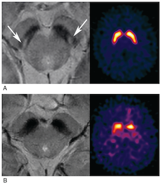
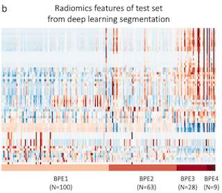
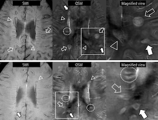
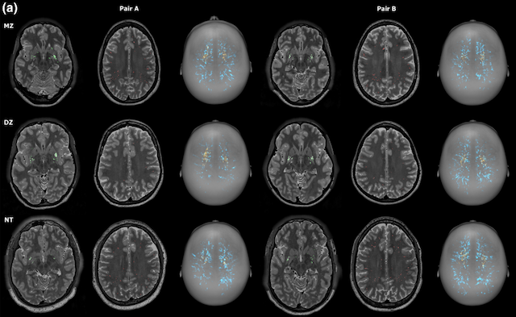
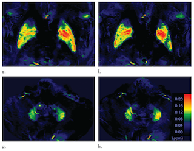

## 2021
1. Determining the Degree of Dopaminergic Denervation Based on the Loss of Nigral Hyperintensity on SMWI in Parkinsonism.
    > Bae, YJ; Song, YS; Kim, J-M; Choi, BS; Nam, Y; Choi, J-H; Lee, WW; Kim, JH;\
    American Journal of Neuroradiology\
    

1. Comparison of susceptibility-weighted imaging and susceptibility map-weighted imaging for the diagnosis of Parkinsonism with nigral hyperintensity. 
    > Bae, Yun Jung; Song, Yoo Sung; Choi, Byung Se; Kim, Jong-Min; Nam, Yoonho; Kim, Jae Hyoung;\
    European Journal of Radiology 134, 109398
    
1. Fully Automatic Assessment of Background Parenchymal Enhancement on Breast MRI Using Machine‐Learning Models. 
    > Nam, Yoonho; Park, Ga Eun; Kang, Junghwa; Kim, Sung Hun;\
     Journal of Magnetic Resonance Imaging 53(3), 818-826\
     [link](https://doi.org/10.1002/jmri.27429)\
     

## 2020

1. Radiomics may increase the prognostic value for survival in glioblastoma patients when combined with conventional clinical and genetic prognostic models. 
    > Choi, Yangsean; Nam, Yoonho; Jang, Jinhee; Shin, Na-Young; Lee, Youn Soo; Ahn, Kook-Jin; Kim, Bum-soo; Park, Jae-Sung; Jeon, Sin-soo; Hong, Yong Gil;\
    European Radiology\
    [link](https://doi.org/10.1007/s00330-020-07335-1)

1. Paramagnetic Rims in Multiple Sclerosis and Neuromyelitis Optica Spectrum Disorder: A Quantitative Susceptibility Mapping Study with 3-T MRI.
    > Jang, Jinhee; Nam, Yoonho; Choi, Yangsean; Shin, Na-Young; An, Jae Young; Ahn, Kook-Jin; Kim, Bum-soo; Lee, Kwang-Soo; Kim, Woojun;\
    Journal of Clinical Neurology 16(4), 562\
    

1. MRI‐visible dilated perivascular spaces in healthy young adults: A twin heritability study. 
    > Choi, Yangsean; Nam, Yoonho; Choi, Yera; Kim, Jiwoong; Jang, Jinhee; Ahn, Kook Jin; Kim, Bum‐soo; Shin, Na‐Young;\
    Human brain mapping\
    

1. MRI and quantitative magnetic susceptibility maps of the brain after serial administration of gadobutrol: a longitudinal follow-up study. 
    > Choi, Yangsean; Jang, Jinhee; Kim, Jiwoong; Nam, Yoonho; Shin, Na-Young; Ahn, Kook-Jin; Jeon, Sin-soo; Kim, Bum-soo;\
    Radiology 297(1), 143-150.\
    [link](https://doi.org/10.1148/radiol.2020192579)\
    

1. Convolutional-neural-network-based diagnosis of appendicitis via CT scans in patients with acute abdominal pain presenting in the emergency department. 
    > Park, Jin Joo; Kim, Kyung Ah; Nam, Yoonho; Choi, Moon Hyung; Choi, Sun Young; Rhie, Jeongbae;\
    Scientific Reports 10(1), 1-9

1. IDH1 mutation prediction using MR-based radiomics in glioblastoma: comparison between manual and fully automated deep learning-based approach of tumor segmentation. 
    > Choi, Yangsean; Nam, Yoonho; Lee, Youn Soo; Kim, Jiwoong; Ahn, Kook-Jin; Jang, Jinhee; Shin, Na-Young; Kim, Bum-Soo; Jeon, Sin-Soo;\
    European Journal of Radiology 128, 109031

### [See in Google Scholar](https://scholar.google.com/citations?hl=ko&user=UZcwGAoAAAAJ&view_op=list_works&sortby=pubdate)